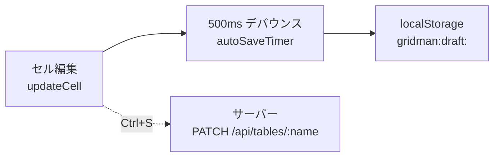
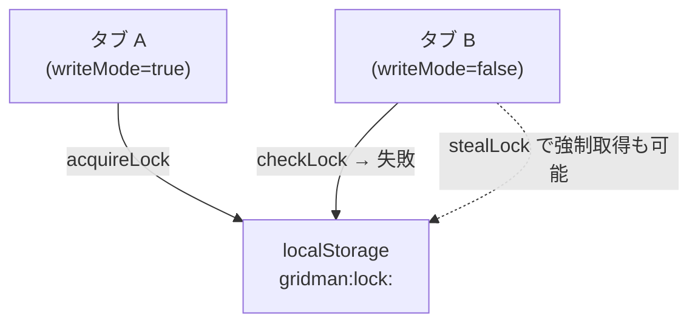

# Query: autosave について調べて

`2026-05-22` に実行された、Gridman における自動保存（Auto Save）、ドラフト管理（Draft）、マルチタブロック（Multi-Tab Lock）の仕様・実装調査結果です。

---

## 🔖 調査概要

Gridman は、Excelライクなリアルタイム編集におけるデータの安全性を高めるため、以下の3つの機能を協調させて動作させています。
1. **自動保存 (Auto Save)**: 編集のたびに自動的に `localStorage` へ状態を退避させる。
2. **ドラフト管理 (Draft)**: メモリ上の状態とローカルのドラフトを紐付け、保存（Ctrl+S）時に消去する。
3. **マルチタブロック (Multi-Tab Lock)**: 複数タブから同一プロジェクトを編集した際の競合を防ぐ。

それぞれの詳細について、[[concepts/Auto_Save_and_Draft]] および `src/stores/project.store.ts`、`src/utils/autoSave.ts` の実装コードから整理しました。

---

## 1. 自動保存とドラフトのフロー

自動保存（ドラフト保存）とサーバー永続化（Ctrl+S）は完全に独立して管理されています。



### 🔹 自動保存のトリガーとフロー
1. セル編集（`updateCell`/`updateCells`）や行の追加・削除（`addRow`/`deleteRow`など）が実行されます。
2. `scheduleAutoSave()` が呼び出され、**500ms のデバウンスタイマー** (`autoSaveTimer`) がセットされます。
3. タイマーが発火すると、プロジェクトパスと全テーブルデータを `saveDraft()` に渡し、`localStorage` にシリアライズして保存します。

### 🔹 localStorage のキー構造
- **ドラフトデータ**: `gridman:draft:<encodeURIComponent(projectPath)>`
  ```ts
  interface DraftData {
    savedAt: number; // 保存タイムスタンプ
    tables: Record<string, Record<string, Row>>; // テーブル名 -> rowId -> 行データ
  }
  ```
- **ロックデータ**: `gridman:lock:<encodeURIComponent(projectPath)>`
  ```ts
  interface LockData {
    tabId: string; // ロックを保持する一意なタブID
    acquiredAt: number; // ロックを取得したタイムスタンプ
  }
  ```

---

## 2. マルチタブロック (Multi-Tab Lock)

同一のプロジェクトが複数のブラウザタブで開かれた場合に、同時書き込みによるデータの先祖返りや競合を防止する排他制御の仕組みです。



### 🔹 ロックの獲得ルール (`acquireLock`)
1. **新規取得**: 既存のロックがない場合は、自タブがロックを取得し書き込みモード (`writeMode = true`) になります。
2. **既存ロックの維持**: 既存のロックが自タブの `tabId` であれば、そのまま維持されます。
3. **競合時のブロック**: 他のタブが30秒以内に更新したロックを持っている場合、ロックの取得に失敗し、そのタブは読み取り専用モード (`writeMode = false`) になります。
4. **自動失効（古いロックの回収）**: 既存のロックが `30秒以上古い` 場合、他タブがクラッシュまたは無反応になったと判断され、ロックを強制取得（上書き）します。

---

## 3. クロスタブ同期 (Cross-Tab Synchronization)

`window` の `storage` イベントを監視（`initStorageSync()`）することで、他タブで行われたドラフト更新やロック状態の変更を検知し、自タブの状態に自動反映します。

### 🔹 同期フロー (`syncDraftFromTab`)
- **ロックイベントの受信**:
  - `lock-acquired` を検知すると、他タブが書き込み権限を持ったと見なし、自タブの `writeMode` を `false` に切り替え、`lockHolderTabId` にその他タブのIDを設定します。
  - `lock-released` を検知すると、`lockHolderTabId` をクリアします。
- **ドラフト更新イベントの受信 (`draft-updated`)**:
  - 他のタブでドラフトが更新された際、読み取り専用モードのタブであっても `localStorage` から最新のドラフトデータを読み込み、メモリ上のテーブルデータ (`tables`) にマージします。これにより、別タブで編集中の最新状態が画面上にリアルタイムで表示されます。

---

## 4. 過去に修正された重要なバグ (Gotchas)

- **すべてのセルが黄色（変更中）になるバグの修正**
  - 以前は `saveDraft` を実行した際、`window.dispatchEvent(new StorageEvent(...))` を用いて同タブに対しても合成 `storage` イベントを強制的に送信していました。
  - しかし、これによって `syncDraftFromTab` が自タブのドラフト変更にも反応してしまい、ドラフト内の全行を `dirtyRowIds` に追加してしまい、結果的にスプレッドシート上のすべてのセルが「編集中の黄色ハイライト」になってしまうバグが起きていました。
  - 現在は合成イベントの dispatch は削除され、ブラウザ本来の「他タブにのみイベントを送る」挙動に委ねることで、このバグは解決されています。

---

## 📅 関連コードファイル
* 🛠️ 状態管理ストア: [project.store.ts](file:///c:/Work/gridman/src/stores/project.store.ts)
* 🛠️ ユーティリティ: [autoSave.ts](file:///c:/Work/gridman/src/utils/autoSave.ts)
