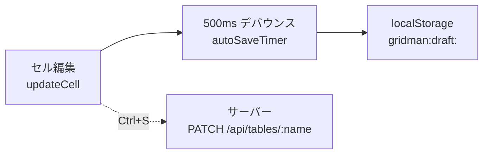
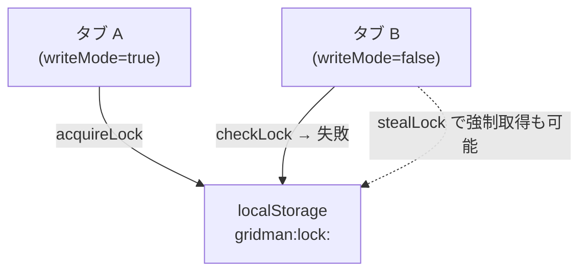

# Auto Save and Draft

セル編集のたびに `localStorage` へ自動保存し、タブ間競合をロックで防ぐ仕組み。

## 概要



`localStorage` への保存（ドラフト）と、サーバーへの保存（Ctrl+S）は独立している。

## localStorage のキー構造

| キー | 内容 |
|------|------|
| `gridman:draft:<encodeURIComponent(path)>` | `DraftData`（テーブル全データ） |
| `gridman:lock:<encodeURIComponent(path)>` | `LockData`（tabId, acquiredAt） |

## ドラフトデータの構造

```ts
interface DraftData {
  savedAt: number
  tables: Record<string, Record<string, Row>>  // テーブル名 → (rowId → Row)
}
```

## 自動保存のフロー

1. `updateCell` / `updateCells` / `addRow` 等が呼ばれる
2. `scheduleAutoSave()` が 500ms デバウンスタイマーをセット
3. タイマー発火 → `saveDraft(projectPath, tables)` で localStorage に保存
4. **同タブへの `storage` イベントは発火しない**（cross-tab のみ）

過去に `window.dispatchEvent(new StorageEvent(...))` で同タブにもイベントを送っていたが、`syncDraftFromTab` が全行を dirty にするバグの原因だったため削除。

## マルチタブロック

同一プロジェクトを複数タブで開いた場合、**最初にロックを取得したタブだけが書き込み可能**になる。



**ロック取得ロジック** (`acquireLock`):
1. 既存ロックがなければ自タブが取得
2. 既存ロックが自タブなら true を返す
3. 既存ロックが 30 秒未満なら取得失敗（他タブが使用中）
4. 30 秒以上古いロックは失効とみなして強制取得

**クロスタブ同期** (`syncDraftFromTab`):
- 他タブが `localStorage` にドラフトを保存すると `storage` イベントが発火
- `syncDraftFromTab` でそのドラフトデータを取り込み `dirtyRowIds` に反映
- write-only タブ（読み取りモード）でも他タブの変更を表示に反映できる

## ドラフト復元

プロジェクトを開く (`loadProject`) 時:
1. `loadDraft(path)` でドラフトを確認
2. ドラフトがあれば `tables` にマージ（既存行を上書き）
3. `hasDraft = true` をセット

保存（Ctrl+S → `saveAll()`）時:
1. PATCH 成功後 `clearDraft(path)` でドラフト削除
2. `hasDraft = false` をセット

## 関連

- [[concepts/architecture/Stores]] — `writeMode` / `isDirty` / `hasDraft` の管理
- [[concepts/spreadsheet/Cell_Editing]] — `updateCell` → `scheduleAutoSave` の連鎖
