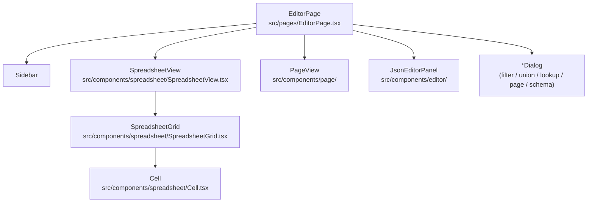
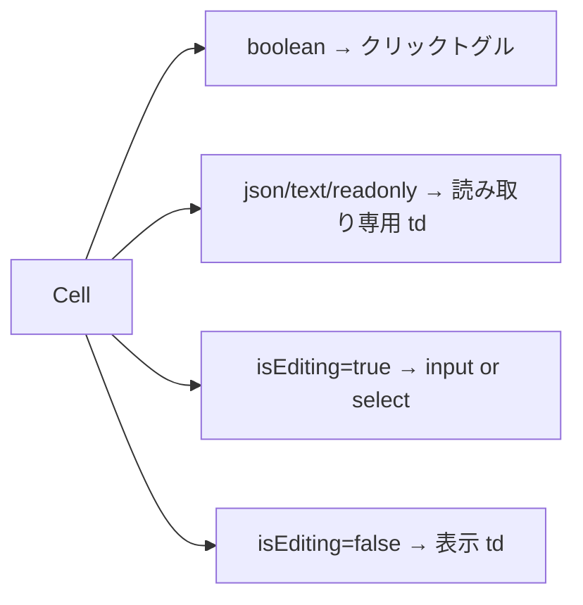

# Component Structure

## コンポーネント階層



---

## EditorPage

`src/pages/EditorPage.tsx`

- グローバルキーボードハンドラーを登録（Ctrl+S / Ctrl+Z / Ctrl+Y / Ctrl+Shift+F）
- サイドバー（テーブル一覧・ビュー一覧）を表示
- アクティブなビュー・テーブルに応じて `SpreadsheetView` または `PageView` を切り替え
- ドラフト確認ダイアログ（現在 TEMP: 無効化中）

**Ctrl+Z の実装**:
```ts
// 編集中のセルがある場合はスキップ（input ネイティブの undo を優先）
if (useSelectionStore.getState().editingCell) return;
undo();
```

---

## SpreadsheetView

`src/components/spreadsheet/SpreadsheetView.tsx`

- ツールバー（フィルター入力・ビュー表示・行追加/削除ボタン）
- `SpreadsheetGrid` へ `rows` / `schema` / `filter` / `visibleColumnKeys` を渡す
- 右クリックコンテキストメニュー（行追加・削除）
- ビュー種別（union / lookup / filter）に応じた表示分岐

---

## SpreadsheetGrid

`src/components/spreadsheet/SpreadsheetGrid.tsx`

グリッドの中核。`GridContext` を提供し、子の `Cell` がこれを消費する。

**GridContext が提供する値**:
```ts
{
  navigate: (rowId, colKey, dRow, dCol) => void  // カーソル移動
  selectionBounds: { minRow, maxRow, minCol, maxCol } | null
  focusContainer: () => void
  onCellMouseDown: (e, pos) => void  // マウスドラッグ選択
  filteredRows: Row[]
  columns: ColumnDef[]
  readOnly: boolean
}
```

**主な責務**:
- フィルタリング・ソート済み行リストの計算
- キーボードナビゲーション（矢印・Page Up/Down・Home/End・Ctrl+矢印）
- Ctrl+C / Ctrl+X コピーカット・グローバルペーストリスナー（Ctrl+V）
- 列ヘッダー（ソート・リサイズ）
- マウスドラッグによる矩形選択

---

## Cell

`src/components/spreadsheet/Cell.tsx`

1 セルのレンダリングと編集。

**レンダリング分岐**:


**dirty 表示**:
- `dirtyCellIds` でセル単位チェック
- フォールバックとして `dirtyRowIds` で行単位チェック（新規行追加・他タブ同期の場合）

**二重 commit 防止**:
`committedRef` フラグで Enter/Tab 後の `onBlur` による二重 `commitEdit` を防止。
（Enter → commitEdit → `setEditing(null)` → フォーカス移動 → `onBlur` が来ても無視）

---

## 関連

- [[Stores]] — EditorPage / Cell が使うストア
- [[concepts/spreadsheet/Cell_Editing]] — セル編集の詳細フロー
- [[concepts/spreadsheet/Input_Behavior]] — キーボード操作仕様
- [[summaries/src-spreadsheet]] — スプレッドシートコンポーネント群のソースコード詳細
