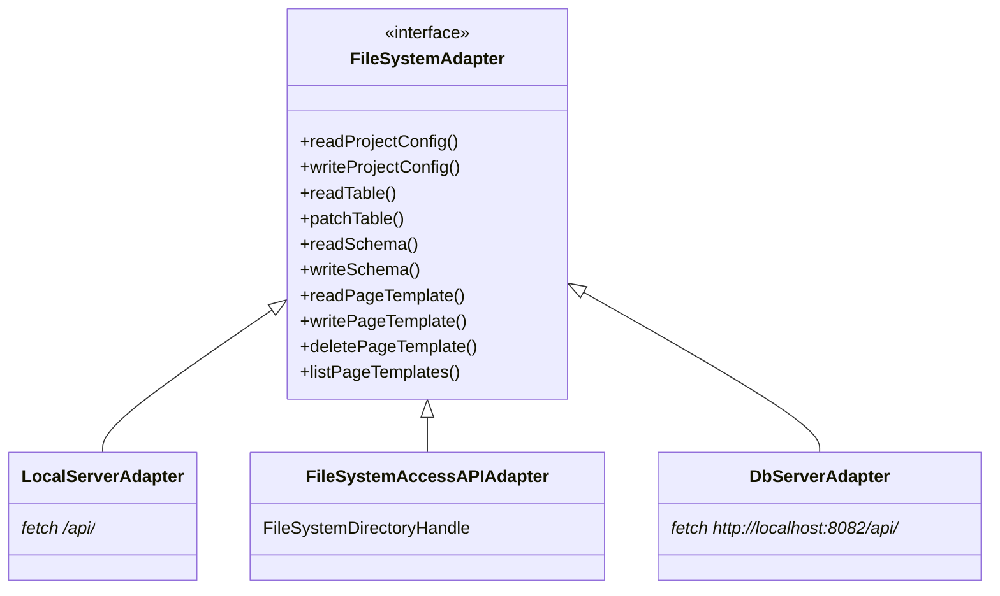

# FileSystem Adapters

`src/fs/` に実装されているファイルアクセス戦略パターン。`FileSystemAdapter` インターフェースを共通口として 3 種類の実装を差し替えられる設計になっている。

## インターフェース定義

```ts
// src/fs/adapter.ts
export interface FileSystemAdapter {
  readProjectConfig(projectPath: string): Promise<ProjectConfig>;
  writeProjectConfig(projectPath: string, config: ProjectConfig): Promise<void>;
  readTable(projectPath: string, tableName: string): Promise<Row[]>;
  patchTable(projectPath: string, tableName: string, rows: Row[]): Promise<void>;
  readSchema(projectPath: string, tableName: string): Promise<TableSchema>;
  writeSchema(projectPath: string, tableName: string, schema: TableSchema): Promise<void>;
  readPageTemplate(projectPath: string, name: string): Promise<PageTemplate>;
  writePageTemplate(projectPath: string, name: string, template: PageTemplate): Promise<void>;
  deletePageTemplate(projectPath: string, name: string): Promise<void>;
  listPageTemplates(projectPath: string): Promise<string[]>;
}
```

## 3 種類の実装



### `LocalServerAdapter`（デフォルト）

Hono サーバー（`:8080`）の REST API を `fetch` で叩く。Vite 開発サーバーの `/api` プロキシ経由でアクセスする。`npm run server` が必要。

### `FileSystemAccessAPIAdapter`

ブラウザの **File System Access API** (`FileSystemDirectoryHandle`) を直接使用。サーバー不要で Chrome/Edge のみ対応。`window.showDirectoryPicker()` で取得したハンドルをコンストラクタに渡す。

- `patchTable` は既存 JSONL を読み込んで差分マージしてから上書き書き込み
- `listPageTemplates` は `dirHandle.values()` でディレクトリを走査

### `DbServerAdapter`

SQLite バックエンドサーバー（`server/db-server.ts`、デフォルト `:8082`）と通信する。`LocalServerAdapter` のドロップイン置き換えとして設計されており、ベース URL を差し替えるだけで使える。

## アダプタの切り替え方法

`useProjectStore` の初期化時にどのアダプタを使うかを決定する。通常は `LocalServerAdapter` を使用する。`FileSystemAccessAPIAdapter` を使うには、`showDirectoryPicker()` を呼び出してハンドルを取得してからアダプタを生成する。

## 関連

- [[System_Overview]] — サーバー構成とプロキシ設定
- [[concepts/data-model/Project_Format]] — アダプタが読み書きするデータ形式
- [[concepts/Auto_Save_and_Draft]] — localStorage ドラフト（アダプタを経由しない）
