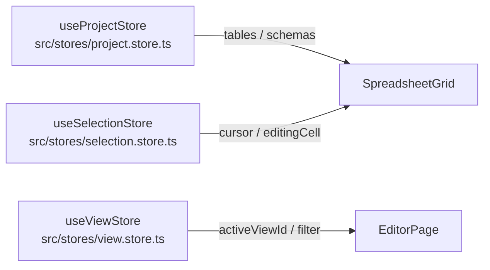

# Stores

状態管理は **3 つの Zustand ストア** で担う。それぞれ責務が明確に分離されている。



---

## useProjectStore

アプリの中心ストア。プロジェクトデータとすべての書き込み操作を管理する。

**主要な状態**

| 状態 | 型 | 内容 |
|------|----|------|
| `projectPath` | string \| null | 開いているフォルダのパス |
| `project` | ProjectConfig | project.json の内容（テーブル名・ビュー定義・enums） |
| `schemas` | Map\<name, TableSchema\> | 全テーブルのスキーマ |
| `tables` | Map\<name, Map\<id, Row\>\> | 全テーブルのデータ（行IDをキーにした Map） |
| `dirtyRowIds` | Map\<name, Set\<id\>\> | 未保存行（保存対象の特定に使用） |
| `dirtyCellIds` | Map\<name, Map\<id, Set\<colKey\>\>\> | 未保存セル（黄色表示に使用） |
| `writeMode` | boolean | 書き込みロック保持中か |
| `isDirty` | boolean | 未保存変更がある場合 true |
| `hasDraft` | boolean | localStorage にドラフトがある場合 true |

`dirtyRowIds` と `dirtyCellIds` は用途が異なる点に注意:
- `dirtyRowIds`: **保存ロジック**（どの行を PATCH するか）
- `dirtyCellIds`: **表示**（どのセルを黄色にするか）

**主なアクション**

```ts
loadProject(path)                         // プロジェクトを開く（ドラフト復元・ロック取得）
saveAll()                                 // Ctrl+S で全テーブル保存
saveTable(name)                           // テーブル単体保存（dirtyRowIds 行のみ PATCH）
updateCell(table, rowId, colKey, value)   // セル値更新（CommandHistory に積む）
updateCells(updates[])                    // 複数セル一括更新（CompositeCommand）
addRow(table)                             // 行追加
addRowAfter(table, afterRowId)            // 指定行の下に行追加
addRowBefore(table, beforeRowId)          // 指定行の上に行追加
deleteRow(table, rowId)                   // 行削除
undo() / redo()                           // CommandHistory 経由
syncDraftFromTab(msg)                     // 他タブのドラフト変更を受信・反映
```

---

## useSelectionStore

スプレッドシートの選択・編集状態。複数コンポーネントをまたいで共有する。

**状態**

| 状態 | 型 | 内容 |
|------|----|------|
| `cursor` | CellPosition \| null | フォーカスセル `{ rowId, colKey, tableName }` |
| `anchorCell` | CellPosition \| null | 範囲選択の起点 |
| `editingCell` | CellPosition \| null | 編集中セル（null = 非編集モード） |
| `editInitialValue` | string \| null | type-to-edit で最初に入力した文字 |

**アクション**

```ts
setCursor(pos)                  // カーソル移動（anchorCell もここにリセット）
extendCursor(pos)               // Shift+矢印での範囲拡張
setEditing(pos | null)          // 編集モード開始/終了
startEditWithInput(pos, char)   // type-to-edit（文字入力で編集開始）
```

`EditorPage` の Ctrl+Z ハンドラは `useSelectionStore.getState().editingCell` を同期的に確認し、編集中は undo をスキップする（input ネイティブの undo を優先）。

---

## useViewStore

アクティブなビューとテーブル横断検索の状態。

**状態**

| 状態 | 内容 |
|------|------|
| `activeViewId` | 左サイドバーで選択中のビュー ID（null = テーブル直接表示） |
| `filter` | スプレッドシートのフィルター文字列（インクリメンタルサーチ） |
| `searchQuery` | テーブル横断検索のクエリ文字列 |
| `searchResults` | 検索結果 |

---

## 関連

- [[System_Overview]] — ストアを使うデータフロー
- [[concepts/Auto_Save_and_Draft]] — `isDirty` / `hasDraft` / `writeMode` の詳細
- [[concepts/Undo_Redo]] — `commandHistory` の仕組み
- [[summaries/src-stores]] — ソースコードから読み解くストアの実装詳細
