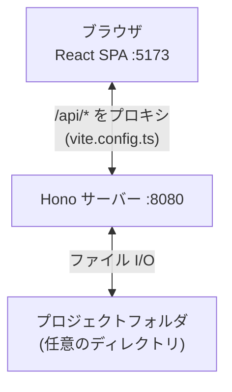
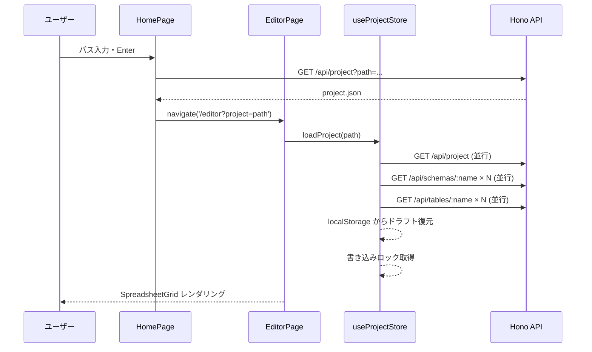
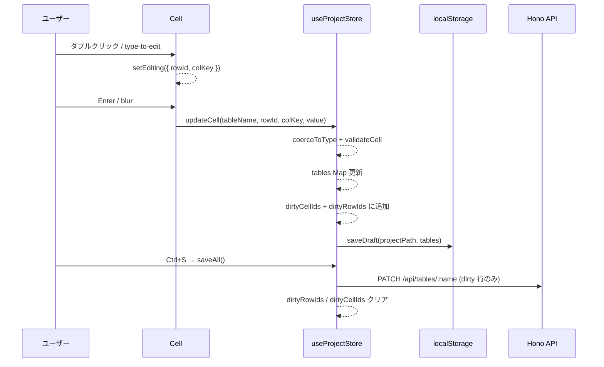

# System Overview

## 全体構成

- **フロントエンド**: Vite + React (TypeScript)。状態管理は [[Stores|Zustand]] 3 ストア体制。
- **バックエンド**: Hono (Node.js)。REST API でファイル読み書きのみ担当。
- **データ**: ローカルファイルシステムに JSONL + JSON Schema として保存。git 差分管理が可能。

開発時は Vite の `/api` プロキシ経由でバックエンドと通信。本番ビルド時はバックエンドが `/dist` の SPA を配信する。

## API エンドポイント

| Method | Path | 内容 |
|--------|------|------|
| GET | `/api/project?path=...` | project.json 読み込み |
| PUT | `/api/project?path=...` | project.json 書き込み |
| GET | `/api/tables/:name?project=...` | JSONL テーブルデータ読み込み |
| PUT | `/api/tables/:name?project=...` | テーブル全置換 |
| PATCH | `/api/tables/:name?project=...` | 変更行のみマージ保存 |
| GET | `/api/schemas/:name?project=...` | スキーマ読み込み |
| GET/PUT/DELETE | `/api/page-templates/:name?project=...` | ページテンプレート CRUD |

**重要**: PATCH はフロント側の `dirtyRowIds` に記録された行だけを送信する。テーブル全体を送らないため効率的。

## プロジェクトを開くフロー

## セル編集から保存まで

## 関連

- [[Stores]] — 状態管理の詳細
- [[concepts/Auto_Save_and_Draft]] — localStorage ドラフトの仕組み
- [[concepts/data-model/Project_Format]] — project.json の形式
- [[summaries/server]] — サーバー実装詳細（2実装・PATCH マージ・SQLite スキーマ）
