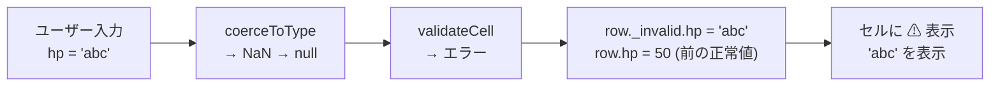

# Table Data

`*.jsonl` はテーブルデータファイル。1 行 = 1 レコードの **JSON Lines** 形式。git で差分が読みやすい。

## 例

```jsonl
{"_id":"e001","_order":1000,"name":"スライム","hp":30,"element":"water"}
{"_id":"e002","_order":2000,"name":"ゴブリン","hp":50,"element":"fire"}
```

## 内部フィールド

| フィールド | 型 | 内容 |
|-----------|-----|------|
| `_id` | string | レコードの一意 ID（英数字ランダム 6 文字） |
| `_order` | number | 表示順。1000 刻み推奨（挿入時に中間値を使う） |
| `_invalid` | Record\<colKey, unknown\> | バリデーション違反値の保持 |

`_id` はフロントエンドが `makeId()` で生成（`Math.random().toString(36).slice(2, 8)`）。

## _order の仕組み

行の表示順は `_order` の昇順。行を挿入するとき中間値を計算することで、全行の `_order` を振り直さずに済む。

```
初期: 1000, 2000, 3000
↓ 1000 と 2000 の間に挿入
→ (1000 + 2000) / 2 = 1500

結果: 1000, 1500, 2000, 3000
```

`_order` が枯渇してきた場合は `npm run dev:gen-dummy` 等で整理が必要（実装は未定）。

## ソフトバリデーション（_invalid）

バリデーション違反値を**捨てずに保存**するのが Gridman の設計方針。



**なぜソフトバリデーションか**: 一括インポートや列型変更の際に、違反値を失わずに「後で直せる」状態を保つため。

## フロントエンドでの保持形式

バックエンドから読み込んだ JSONL は `Map<string, Map<string, Row>>` として保持:

```
tables: {
  "enemy" → {
    "e001" → { _id: "e001", _order: 1000, name: "スライム", hp: 30 },
    "e002" → { _id: "e002", _order: 2000, name: "ゴブリン", hp: 50 },
  }
}
```

外側のキーはテーブル名、内側のキーは `_id`。

## 関連

- [[Schema_Definition]] — テーブルのカラム型定義
- [[concepts/architecture/Domain_Logic]] — `coerceToType` / `validateCell`
- [[concepts/architecture/Stores]] — `useProjectStore.tables` として保持
