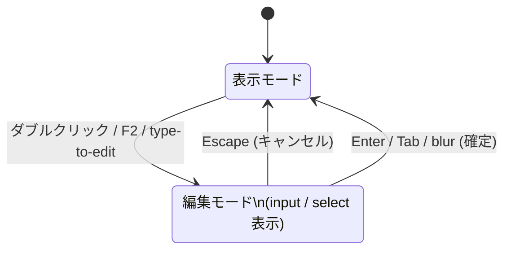

# Cell Editing

セルの編集フローと dirty（未保存）状態の追跡。

## 編集フロー



編集モードへの切り替えは `useSelectionStore.setEditing(pos)` が担う。

## commitEdit の二重防止

Enter/Tab で編集を確定すると:
1. `commitEdit(editValue)` が呼ばれる → `updateCell(...)` + `setEditing(null)`
2. フォーカスがグリッドコンテナに移動 → input の `onBlur` が発火
3. `onBlur` も `commitEdit` を呼ぼうとする

この二重呼び出しで **undo スタックに同じ値のコマンドが 2 つ積まれ**、Ctrl+Z を 2 回押さないと undo が見えない問題が発生していた。

**修正**: `committedRef` フラグで一度確定した後の `onBlur` を無視する。

```ts
const committedRef = useRef(false)

useEffect(() => {
  if (isEditing) committedRef.current = false  // 編集開始時にリセット
}, [isEditing])

const commitEdit = (val: string) => {
  if (committedRef.current) return   // 二重呼び出し防止
  committedRef.current = true
  updateCell(tableName, rowId, col.key, val)
  setEditing(null)
}
```

## Dirty（未保存）状態の追跡

セルを編集すると 2 種類の dirty 状態が記録される:

| 状態 | 粒度 | 用途 |
|------|------|------|
| `dirtyRowIds` | 行単位 | 保存ロジック（どの行を PATCH するか） |
| `dirtyCellIds` | セル単位 | 表示（どのセルを黄色にするか） |

**Cell.tsx での判定ロジック**:
```ts
const isDirty =
  dirtyCellIds.get(tableName)?.get(rowId)?.has(col.key) ??   // セル単位（優先）
  dirtyRowIds.get(tableName)?.has(rowId) ??                  // 行単位（新規行追加等のフォールバック）
  false
```

**黄色になるケース**:
- `updateCell` / `updateCells`: 編集したセルだけが黄色（`dirtyCellIds`）
- `addRow` / `addRowAfter` / `addRowBefore`: 新規行の全セルが黄色（`dirtyRowIds` のみ）
- 他タブからの `syncDraftFromTab`: 同期された行の全セルが黄色（`dirtyRowIds` のみ）

**黄色が消えるタイミング**: Ctrl+S → `saveAll()` → `saveTable()` → `dirtyRowIds` / `dirtyCellIds` をクリア

## type-to-edit

非編集モードで印字可能文字を入力すると即座に編集モードに入り、その文字が入力値の初期値になる。

```ts
startEditWithInput(pos, char)  // useSelectionStore
// → editingCell = pos, editInitialValue = char
```

`Cell` は `editInitialValue !== null` のとき `editValue` をその文字で初期化する（既存値を上書き）。

## 関連

- [[concepts/architecture/Component_Structure]] — Cell コンポーネントの構造
- [[concepts/Undo_Redo]] — updateCell が CommandHistory に積む仕組み
- [[Input_Behavior]] — Enter / Tab / Escape の挙動仕様
