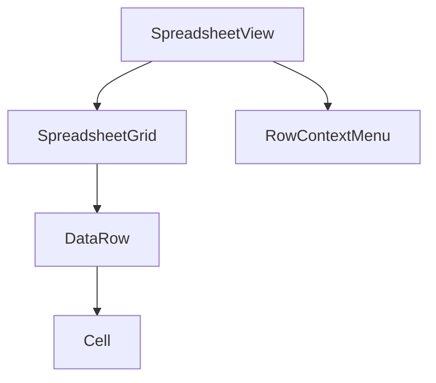
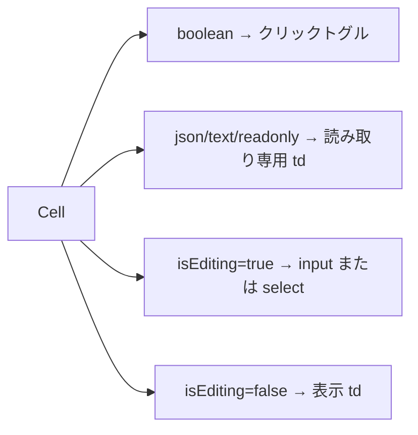

# src-spreadsheet — スプレッドシート UI コンポーネント群

> ソース: [[raw/refs/src-spreadsheet]] (`src/components/spreadsheet/`)

グリッド表示・セル編集・キーボードナビゲーションを担う 8 ファイル構成。

---

## コンポーネント階層

---

## SpreadsheetView.tsx

ツールバー + `SpreadsheetGrid` + `RowContextMenu` の統合レイヤー。

**ツールバーの要素**:
- クイックフィルター入力（`useViewStore.filter` にバインド）
- アクティブビュー pill（ビュー名・編集ボタン・閉じるボタン）
- 行追加 / 行削除ボタン
- 行数 + 選択行数の表示

**ビュー種別の分岐**: `activeView.query.type` が `union` / `lookup` の場合は行追加ボタンを非表示にし、削除時はソーステーブルを `_source` / `_sources` フィールドから特定して正しいテーブルに `deleteRow` を呼ぶ。

---

## SpreadsheetGrid.tsx

グリッドの中核。`GridContext` を提供し、子コンポーネントにナビゲーション・選択・フォーカス操作を共有する。

**主な責務**:
- `applyFilter` + `applySort` で表示行リストを計算（`src/domain/filter.ts`）
- キーボードナビゲーション（矢印・Page Up/Down・Home/End・Ctrl+矢印）を `useKeyboardNavigation` に委譲
- Ctrl+C / Ctrl+X コピーカット、Ctrl+V ペースト（グローバルリスナー）
- マウスドラッグによる矩形範囲選択
- 列ヘッダークリックでのソート切り替え、列幅リサイズを `useColumnResize` に委譲
- `useVirtualScroll` で大量行の仮想描画

---

## Cell.tsx

1 セルのレンダリングと編集状態管理。

**レンダリングの 4 分岐**:

- `boolean` 型: td 自体がボタンとして機能し、クリックで `updateCell` を直接呼ぶ
- `json`・`text`・`readonly`: 編集モードに入らない。クリックで `jsonPanelCell` を設定
- 編集中: 型に応じて `<input>` または `<select>` を描画
- `committedRef` フラグで Enter/Tab 後に発火する `onBlur` の二重 `commitEdit` を防止

**dirty 表示**: `dirtyCellIds`（セル単位）→ フォールバックで `dirtyRowIds`（行単位）の順でチェック。

---

## カスタムフック

| フック | 役割 |
|--------|------|
| `useVirtualScroll.ts` | 表示ウィンドウ内の行インデックス計算 |
| `useKeyboardNavigation.ts` | 矢印・Tab・Enter・Escape のキーイベント処理 |
| `useColumnResize.ts` | 列ヘッダーのドラッグリサイズ |

---

## 関連

- [[concepts/spreadsheet/Cell_Editing]] — commitEdit フロー・dirty 追跡の詳細
- [[concepts/spreadsheet/Input_Behavior]] — キーボード操作仕様
- [[concepts/architecture/Component_Structure]] — コンポーネント階層の全体像
- [[summaries/src-stores]] — Cell が使う `useSelectionStore` / `useProjectStore`
